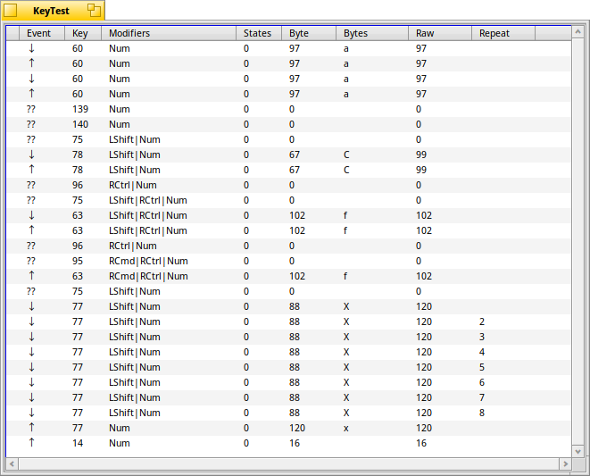

## KeyTest

KeyTest is a small test application for the Haiku operating system. It displays keyboard event information that is received by a BView.

------------------------------------------------------------





### Build Instructions

You must have the `jamfile_engine` package installed in order to build.

```
~> cd KeyTest
~/KeyTest> jam
```
